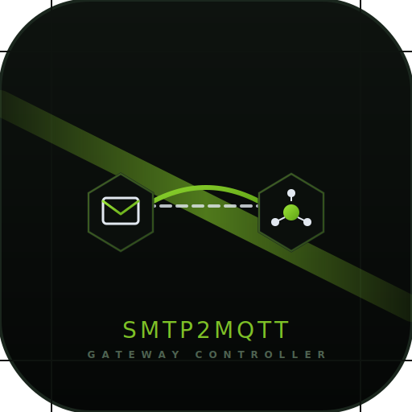

# smtp2mqtt

<p align="center">
  
</p>

[](https://github.com/onhala/smtp2mqtt/actions/workflows/test.yml)
[](https://github.com/onhala/smtp2mqtt/releases)
[](https://www.python.org/)
[](LICENSE)
[](Dockerfile)
[](https://www.loxone.com)

A lightweight, high-performance, and fully asynchronous SMTP-to-MQTT bridge. It runs an unthreaded SMTP gateway, receives emails (e.g., motion detection trigger emails from Hikvision cameras), and publishes trigger payloads directly to an MQTT broker.

This is a modernized version of `wicol/emqtt` redesigned for modern Python (3.10+ / 3.13+), resolving event loop issues and utilizing non-blocking asynchronous IO. It is specifically designed to integrate camera motion detection triggers with automation systems like **Loxberry (MQTT Gateway) and Loxone**.

---

## Features

- **Fully Asynchronous Architecture**: Rewritten using Python's modern `async/await` and `aiosmtpd.controller.UnthreadedController` for non-blocking network and email processing.
- **Non-blocking IO Execution**: Blocking synchronous operations (such as MQTT publishing and file saving) are executed on a separate thread pool using `asyncio.to_thread` to maintain loop performance.
- **Graceful Shutdown**: Properly handles termination signals (`SIGINT`, `SIGTERM`) to clean up connections, stop the SMTP server, and cancel active reset timers.
- **Automatic Topic Resets**: Automatically schedules a reset payload (e.g., `OFF`) after a configurable delay when a trigger payload (e.g., `ON`) is sent.
- **Optional Image Attachment Saving**: Extracts and saves image attachments (e.g., snapshots from cameras) to a persistent folder.
- **Robust Configuration**: Robust, case-insensitive parsing of boolean parameters from environment variables.

---

## ⚙️ How It Works & Configuration

1. The gateway listens on a configured SMTP port (default: `1025`).
2. When an email is received from `camera1@home.com`, it parses the sender and converts it to an MQTT topic:  
   `smtp2mqtt/camera1-home.com`
3. It publishes a trigger payload (`ON`) to the topic.
4. If image attachments are present and `SAVE_ATTACHMENTS` is enabled, it stores them under the `attachments/` folder.
5. If `MQTT_RESET_TIME` is set (e.g., `10` seconds), it schedules a task that will automatically publish a reset payload (`OFF`) to the same topic after the timer expires, resetting the Loxone input.

---

### Configuration (Environment Variables)

| Variable | Description | Default |
| :--- | :--- | :--- |
| `SMTP_PORT` | Port the SMTP gateway listens on | `1025` |
| `MQTT_HOST` | Hostname or IP of the MQTT broker (e.g., Loxberry) | `localhost` |
| `MQTT_PORT` | Port of the MQTT broker | `1883` |
| `MQTT_USERNAME` | Username for the MQTT broker (optional) | `""` |
| `MQTT_PASSWORD` | Password for the MQTT broker (optional) | `""` |
| `MQTT_TOPIC` | Root prefix for published MQTT topics | `smtp2mqtt` |
| `MQTT_PAYLOAD` | Payload published when an email is received (Trigger) | `ON` |
| `MQTT_RESET_TIME` | Delay in seconds before resetting the topic (`0` to disable) | `10` |
| `MQTT_RESET_PAYLOAD` | Payload published when the reset timer expires | `OFF` |
| `SAVE_ATTACHMENTS` | Whether to extract and save attached image snapshots | `False` |
| `SAVE_ATTACHMENTS_DURING_RESET_TIME` | Save images from emails arriving while reset timer is active | `False` |
| `CLEANUP_ATTACHMENTS_DAYS` | Automatically delete saved attachments older than N days (`0` to disable) | `30` |
| `CLEANUP_LOGS_DAYS` | Automatically delete rotated log files older than N days (`0` to disable) | `30` |
| `CLEANUP_INTERVAL_SECONDS` | Interval in seconds between automatic cleanup execution loops | `86400` |
| `ENABLE_WEB` | Enable the built-in zero-dependency HTTP server for stats/dashboard | `True` |
| `WEB_PORT` | Port the built-in HTTP server listens on | `8080` |
| `DEBUG` | Enable verbose debug logging | `False` |

---

### 🧹 Automatic File & Log Cleanup

To prevent disk space exhaustion (especially when running in Docker or on lightweight systems like Loxberry), `smtp2mqtt` includes a built-in, asynchronous background cleanup process. It periodically scans target directories and securely removes files exceeding the retention threshold without blocking email processing:

- **Attachments Retention**: Controlled by `CLEANUP_ATTACHMENTS_DAYS` (default: `30` days). Saved attachments older than this limit are pruned.
- **Logs Retention**: Controlled by `CLEANUP_LOGS_DAYS` (default: `30` days). Rotated log files older than this limit are pruned.
- **Safety Guards**: Hidden system files and tracking files (such as `.gitkeep`) are automatically ignored to preserve repository and workspace configuration.
- **Interval**: Runs asynchronously on container startup and repeats every `CLEANUP_INTERVAL_SECONDS` (default: `86400` seconds / 24 hours).

---

## 📊 Web Dashboard & Integrations

The gateway features a built-in, lightweight async HTTP server. When `ENABLE_WEB=True` (enabled by default), you can access:
- **Status Dashboard (`http://localhost:8080/`)**: A premium, real-time dark-mode dashboard showing:
  - Dynamic uptime tracking and processed messages counts.
  - Live connection status indicators for both the MQTT broker and SMTP server.
  - A secure, XSS-protected real-time log of recent email triggers and publish actions.
  - **Container Versioning & Update Checker**: Instantly displays the currently running version of the container alongside a live, asynchronous GitHub integration checker that queries the GitHub Releases API to notify you in real-time when a newer image version is available.
- **JSON Status API (`http://localhost:8080/api`)**: Returns dynamic status JSON including running version info, the latest available version on GitHub, and update availability status, alongside helper fields tailored for external dashboards (such as `gethomepage.dev`).

---

### Homepage Integration (gethomepage.dev)

You can easily integrate `smtp2mqtt` with your Homepage dashboard using the pre-configured [homepage_widget.yaml](homepage_widget.yaml) configuration. It utilizes Homepage's `customapi` widget to map dynamic stats from the `/api/status` endpoint.

Depending on where you want to place the widget, choose one of the following configurations:

#### Option A: In `widgets.yaml` (As a standalone widget)

```yaml
- customapi:
    name: smtp2mqtt Gateway
    icon: mdi-email-sync-outline
    url: http://<smtp2mqtt-ip>:8080/api/status
    method: GET
    headers:
      Accept: application/json
    mappings:
      - field: processed_messages_count
        label: Messages
        format: number
      - field: uptime_formatted
        label: Uptime
      - field: smtp_status_text
        label: SMTP
      - field: mqtt_status_text
        label: MQTT
```

#### Option B: In `services.yaml` (Nested under a service card)

```yaml
- Smart Home Infrastructure:
    - smtp2mqtt Gateway:
        icon: mdi-email-sync-outline
        href: http://<smtp2mqtt-ip>:8080
        widget:
          type: customapi
          url: http://<smtp2mqtt-ip>:8080/api/status
          method: GET
          headers:
            Accept: application/json
          mappings:
            - field: processed_messages_count
              label: Messages
              format: number
            - field: uptime_formatted
              label: Uptime
            - field: smtp_status_text
              label: SMTP
            - field: mqtt_status_text
              label: MQTT
```


---

## 🐋 Docker & Portainer Deployment

The container is built on top of the official, ultra-lightweight `python:3.13-slim` image and runs inside `/app`.


### 1. Pull or Build the Docker Image

You can pull the official pre-built, multi-architecture image directly from the GitHub Container Registry (recommended):
```bash
docker pull ghcr.io/onhala/smtp2mqtt:latest
```

Alternatively, you can build the image locally from source:
```bash
docker build -t smtp2mqtt .
```

### 2. Run the Container
Run the container on your host machine or server (e.g., Loxberry/Synology/RPi). Make sure to bind your ports and map volumes to persist logs and attachments.

```bash
docker run -d \
    --name smtp2mqtt \
    -p 1025:1025 \
    -p 8080:8080 \
    --restart always \
    -e "SMTP_PORT=1025" \
    -e "MQTT_HOST=192.168.1.50" \
    -e "MQTT_USERNAME=my_mqtt_user" \
    -e "MQTT_PASSWORD=my_mqtt_password" \
    -e "SAVE_ATTACHMENTS=True" \
    -e "DEBUG=False" \
    -v /etc/localtime:/etc/localtime:ro \
    -v smtp2mqtt_log:/app/log \
    -v smtp2mqtt_attachments:/app/attachments \
    ghcr.io/onhala/smtp2mqtt:latest
```

> [!NOTE]
> Standard bridge networking is fully supported. You do **not** need to run with `--net host`, which provides better isolation and makes the gateway fully compatible with all environments (including Docker Desktop on macOS and Windows).

> [!TIP]
> We use **Docker Named Volumes** (`smtp2mqtt_log` and `smtp2mqtt_attachments`) by default because Docker manages them automatically and ensures correct write permissions for the container's non-root user.
>
> If you prefer to use local host directories (**bind-mounts**) like `-v $PWD/log:/app/log`, you must ensure the host folders are writable by the container's system user (`UID 10001`) by running `sudo chown -R 10001:10001 log attachments` on the host machine.

### 3. Docker Healthcheck

The Docker container now includes a built-in `HEALTHCHECK` directive that runs a lightweight, zero-dependency Python script (`healthcheck.py`) every 30 seconds.

The healthcheck connects to the SMTP port, validates that the SMTP server is active, and verifies that it is returning a healthy SMTP banner (`220`). If the container ever freezes, Docker will automatically flag it as `unhealthy`. When run with `--restart always`, Docker will automatically reboot the container to restore your smart home automation flows instantly.

### 4. Automatic Redeployment via Portainer Webhook

If you deploy `smtp2mqtt` inside Portainer and want the container to automatically pull the new image and redeploy itself whenever a new version is pushed to GHCR (or your custom registry), you can configure a Portainer Webhook:

1. **Enable Webhook in Portainer**: 
   - Go to your Portainer Dashboard, open your `smtp2mqtt` container (or service/stack) settings.
   - Scroll down to **Webhooks** and toggle **Create a container webhook** (or service webhook) to **On**.
   - Copy the generated Webhook URL (it looks like `http://<portainer-ip>:9000/api/webhooks/secure/xxxxxxxx-xxxx-xxxx-xxxx-xxxxxxxxxxxx`).

2. **Configure GitHub Secret**:
   - In your GitHub repository, navigate to **Settings** > **Secrets and variables** > **Actions**.
   - Click **New repository secret**.
   - Name the secret **`PORTAINER_WEBHOOK_URL`** and paste the copied Portainer Webhook URL as its value.

Once configured, the GitHub Actions workflow (`docker-publish.yml`) will automatically trigger the webhook via a secure POST request upon every successful multi-arch build. Portainer will immediately download the updated image and restart the container with zero downtime or manual intervention needed.

### 5. Secure HTTPS Deployment (Caddy / Portainer Stack)

If you are running `smtp2mqtt` in a production-like environment (e.g., inside Portainer or exposed to external networks) and want to secure your web status dashboard and JSON API via HTTPS, it is highly recommended to run it behind a **Reverse Proxy**.

We have provided a fully configured deployment template using **Caddy** in the [deploy](deploy/) directory. Caddy automatically provisions and renews SSL/TLS certificates (via Let's Encrypt / ZeroSSL) while keeping your `smtp2mqtt` application lightweight and robust.

Please refer to the [deploy/README.md](deploy/README.md) for step-by-step configuration and Docker Compose template details.

---


### 🧹 Fully Automated Maintenance

With the native [Automatic File & Log Cleanup](#-automatic-file--log-cleanup) built directly into the core engine of `smtp2mqtt`, manual maintenance and host-level cron jobs are completely redundant. The container automatically manages its disk space on a configurable, asynchronous background schedule.

---

## 🛠️ Local Development & Testing

This project contains a comprehensive automated test suite to ensure robustness, compatibility, and prevent regressions.

### Running Tests Locally

1. Create and activate a Python virtual environment:
   ```bash
   python -m venv .venv
   source .venv/bin/activate
   ```

2. Install dependencies (including testing tools):
   ```bash
   pip install -r requirements.txt
   pip install -r requirements-dev.txt
   ```

3. Run the test suite:
   ```bash
   pytest tests/ -v
   ```

The test suite includes both mock-based unit tests (testing attachment parsing and MQTT publishing logic without needing an active broker) and a full, end-to-end integration test (which spins up the real SMTP server on a random high port, initiates a real SMTP transaction using `smtplib`, and gracefully shuts down, confirming logs match expected behaviors).

### Local Simulation & Interactive Testing

For interactive local testing without needing a real MQTT broker or external SMTP servers, a comprehensive simulation tool is provided under `scratch/simulate.py`. This script spins up a mock MQTT broker on port `1883` and allows you to trigger mock email events instantly to verify parsing, attachment handling, and UI updates.

#### 1. Start the Simulation Environment

Run the simulation script with no arguments. This starts a mock MQTT broker in a background thread and opens an interactive console:
```bash
python scratch/simulate.py
```

#### 2. Run the smtp2mqtt Gateway

In a separate terminal tab or window, run the main gateway application (ensuring you are in your virtual environment):
```bash
python smtp2mqtt.py
```
This automatically connects to the mock MQTT broker on `localhost:1883`, starts the SMTP receiver on port `1025`, and serves the live Web Status Dashboard on `http://localhost:8080`.

#### 3. Trigger Mock Email Alerts

Go back to the simulation terminal window. You can interact with the environment using simple keyboard commands:
* Press **`E`** to send a mock security alert email to the SMTP server (listening on port `1025`). This email contains a sample camera JPEG snapshot.
  * The gateway will receive the email, parse the attachment, save it in the `attachments/` directory, and publish a triggered state (`ON`) to the MQTT broker.
  * After 10 seconds (default `MQTT_RESET_TIME`), the gateway automatically schedules and publishes a reset state (`OFF`) to the broker.
* Press **`Q`** to shut down the simulation and stop the background mock broker cleanly.

#### 4. Monitor Real-Time Status

Open **`http://localhost:8080`** in your browser to view the dynamic dashboard. You will see:
* Real-time pulsating status indicators showing that both the **SMTP Server** and **MQTT Broker** are healthy/online.
* An interactive **Recent Actions** table listing all email transactions, their sender details, mapped MQTT topics, and payloads, fully protected from XSS.
* Dynamic counts of processed messages and uptime tracking.

### Automated Testing (CI)

Every code push or Pull Request to the repository triggers a GitHub Actions workflow (`.github/workflows/test.yml`). It sets up a clean environment, installs all dependencies, and runs the entire `pytest` suite. This gives you a clear visual indicator of code health directly on GitHub.

---

## ❓ Troubleshooting & FAQ

### `PermissionError: [Errno 13] Permission denied: '/app/log/smtp2mqtt.log'`

For security, the Docker container runs as a non-privileged system user (`appuser` with UID `10001`). If you are using **bind-mounts** (such as `./log:/app/log` or `./attachments:/app/attachments`), the mounted directories on the host must be writable by UID `10001`.

To resolve this, you have two options depending on your deployment style:

#### Option A: Fix permissions on the host (recommended for CLI / SSH)
If you have SSH access to the host machine, navigate to your deployment folder and run:
```bash
sudo chown -R 10001:10001 log attachments
```

#### Option B: Use Named Volumes (recommended for Portainer & NAS)
If you deploy via Portainer (Stacks / Compose) and don't want to manage host-level permissions, switch from bind-mounts to **Docker Named Volumes**. Docker automatically manages the directories and ensures the non-root container user has full read/write access.

Update your `docker-compose.yml` as follows:

```yaml
services:
  smtp2mqtt:
    # ... other config ...
    volumes:
      - /etc/localtime:/etc/localtime:ro
      - smtp2mqtt_log:/app/log
      - smtp2mqtt_attachments:/app/attachments

volumes:
  smtp2mqtt_log:
  smtp2mqtt_attachments:
```

---

## License

This project is licensed under the MIT License - see the [LICENSE](LICENSE) file for details.
